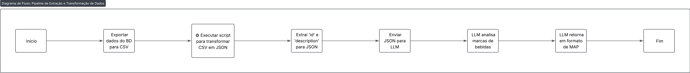

## Diagrama

## 📋 Informações do Diagrama

Este diagrama ilustra o processo completo de extração e transformação de dados, partindo da exportação de informações de um banco de dados em formato CSV até a análise realizada por um modelo de linguagem (LLM). O pipeline também contempla a conversão dos dados para JSON, extração de campos relevantes e o retorno estruturado do LLM em formato MAP.

---

## 🛠️ Procedimento Operacional Padrão (SOP)

1. **Início:** Ponto de partida do processo.
2. **Exportar dados do banco de dados para CSV:** Realizar a exportação dos dados disponíveis em um arquivo `.csv`.
3. **Executar script para transformar CSV em JSON:** Converter o arquivo `.csv` para um objeto JSON.
4. **Extrair `id` e `description` para JSON**: Filtrar e manter apenas os campos relevantes no objeto JSON.
5. **Enviar JSON para LLM**: Encaminhar o JSON para um modelo de linguagem natural para análise.
6. **LLM analisa marcas de bebidas**: O modelo interpreta os dados com foco em identificar ou classificar marcas de bebidas.
7. **LLM retorna em formato de MAP:** O retorno do modelo vem estruturado em um formato MAP para uso posterior.
8. **Fim**: Conclusão do processo de transformação e análise.
